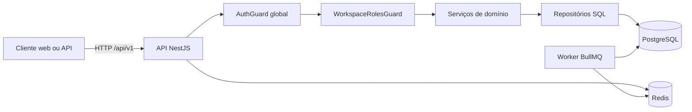
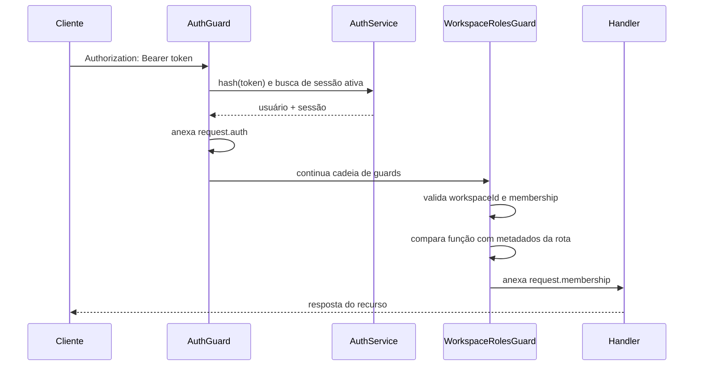

# Arquitetura

## Visão geral

A API é a fronteira de identidade e autorização. O PostgreSQL mantém identidade, sessões, workspaces, memberships e auditoria. O Redis permanece reservado para filas e coordenação assíncrona; ele não participa da autenticação deste marco.

## Modo de simulação web

Enquanto a infraestrutura local não estiver disponível, a aplicação web oferece
um modo demonstrativo autônomo. O repositório de demonstração vive no cliente,
tem seed versionado no código e grava as alterações em \`localStorage\`; a sessão
da aba usa \`sessionStorage\`. Esse modo reproduz as regras de RBAC para
apresentação, mas não substitui a autorização da API em uma implantação real.

### Agenda operacional do Marco 4

As tarefas demonstrativas e seus eventos ficam no mesmo repositório local do
navegador. A fronteira do provedor externo é
apps/web/app/lib/demo-x-adapter.ts; no Marco 4 ela apenas confirma uma
execução simulada. A implementação não acessa a API do X, OAuth, proxy ou
segredos. Quando a integração real for iniciada, este adaptador será substituído
sem acoplar o dashboard ao SDK do provedor.

### Planos e consumo do Marco 5

O plano e o consumo demonstrativos pertencem ao workspace e são calculados no
repositório local antes de uma execução. A interface não decide se a execução
é permitida: ela solicita a operação ao repositório, que aplica a cota e a
regra de Owner para troca de plano. Em produção, essa responsabilidade migrará
para a API, integrada ao billing e ao ledger de consumo.

### Cobrança sandbox do Marco 6

O dashboard consulta o repositório de demonstração para exibir a assinatura e
os eventos reconciliados. O adaptador local de Stripe devolve eventos sintéticos
e o repositório aplica o status antes de liberar uma execução. Em produção, o
webhook será recebido e validado pela API, que manterá o registro financeiro e
de consumo no servidor.

### Administração do Marco 7

O painel administrativo demonstrativo obtém uma visão agregada do repositório
local apenas quando o usuário possui o papel Owner. A trilha de auditoria é
gerada pelas mutações administrativas e operacionais no mesmo armazenamento.
Em produção, consultas administrativas, auditoria imutável, busca e retenção
serão operações exclusivas da API, com uma permissão de plataforma dedicada.

### Prontidão de integrações do Marco 8

O painel de prontidão lê uma configuração do mesmo repositório local e torna
visíveis os limites do site estático. A flag do adaptador local do X é alterada
somente por Owner, é auditada e impede novas execuções simuladas quando
desativada. Ela não contém segredos nem aciona provedores externos. No modo de
produção, essa configuração deverá ser aplicada no servidor, por workspace,
com autorização de plataforma e trilha imutável.

### Perfil local do Marco 10

A rota de perfil mantém a interação de UX/UI em um componente próprio. Ela lê
a sessão local, delega a alteração de nome ao repositório de demonstração e não
aceita mudança de e-mail, senha ou identidade externa. Essa separação preserva
uma troca futura do repositório local pela API sem acoplar a tela à persistência
de produção.

### Configurações de workspace do Marco 11

A identificação do workspace é alterada por uma rota específica que delega a
validação de Owner ao repositório. O slug fica estável para representar a futura
chave pública do workspace, enquanto o nome é uma propriedade de apresentação.
Essa decisão evita que uma atualização visual quebre referências antes da API
assumir o controle transacional em produção.

## Componentes

### packages/contracts

Schemas Zod e tipos compartilhados. Centraliza normalização de e-mail, política mínima de senha, papéis de workspace e payloads HTTP.

### apps/api/src/auth

Responsável por derivação de senha, emissão e hash de tokens, cadastro, login, logout, resolução de sessão e contexto do usuário autenticado.

### apps/api/src/workspaces

Responsável por workspaces, memberships, matriz de funções e invariantes administrativas. Controllers validam entradas; services aplicam políticas; repositories garantem atomicidade e locks.

### apps/api/src/database

Mantém um pool PostgreSQL compartilhado e fornece transações com commit, rollback e liberação garantida do client.

### apps/api/src/common

Contém os mecanismos transversais: marcação de rota pública e tradução de falhas de schema para erro HTTP 400.

## Fluxo de requisição autenticada

## Decisões

### PostgreSQL e SQL explícito

O marco usa pg e migrações SQL versionadas. Isso mantém constraints e transações visíveis, evita acoplamento precoce a um ORM e facilita auditar as regras de isolamento.

### Sessão opaca revogável

O cliente recebe um token aleatório. O banco armazena somente seu hash. Cada requisição resolve a sessão ativa no banco; logout marca revoked_at. O custo é uma consulta por requisição, aceito neste estágio para obter revogação imediata e comportamento simples.

### Autorização negada por padrão

AuthGuard é global. Uma rota somente se torna pública com o decorator Public. Regras de workspace são declaradas com WorkspaceRoles e verificadas por um segundo guard global.

### Serviços e repositórios

Políticas legíveis ficam nos services. Invariantes que dependem de concorrência ficam em transações dos repositories. Controllers apenas validam e traduzem HTTP.

## Fronteiras de segurança

- Senhas de contas do X nunca entram neste módulo.
- Senhas locais são derivadas; não há mecanismo de recuperação neste marco.
- Tokens opacos aparecem somente na resposta de criação/login e no header do cliente.
- E-mails são normalizados para minúsculas antes da persistência.
- Consultas de recursos de workspace usam workspaceId e userId/membership.
- Toda mutação administrativa relevante gera audit_event.
