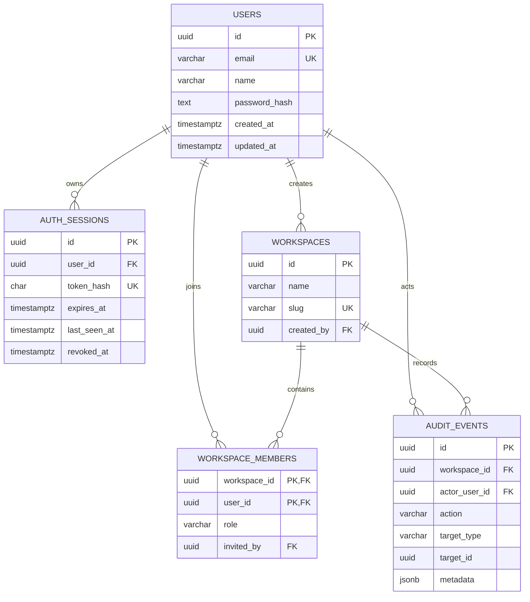

# Modelo de dados

A migração inicial está em apps/api/migrations/001_identity_and_workspaces.sql.

## Diagrama

## Tabelas

### users

Identidade local. email é único e possui constraint de normalização para minúsculas. password_hash guarda o formato versionável scrypt$custo$bloco$paralelismo$salt$chave.

### auth_sessions

Sessões revogáveis. token_hash é SHA-256 hexadecimal do token opaco entregue ao cliente. Uma sessão é válida quando revoked_at é nulo e expires_at está no futuro. Há índice parcial para sessões ativas por usuário.

### workspaces

Tenant lógico. slug é único e recebe um sufixo aleatório para reduzir colisões. created_by é histórico e usa exclusão restrita.

### workspace_members

Relacionamento muitos-para-muitos entre usuário e workspace. A chave primária composta impede memberships duplicadas. role aceita apenas OWNER, ADMIN, OPERATOR ou VIEWER.

### audit_events

Registro append-only das mutações administrativas do marco. metadata guarda contexto não estrutural, como função anterior e nova.

### schema_migrations

Criada pelo executor antes das migrações de domínio. Guarda nome, checksum e instante de aplicação. Se o conteúdo de uma migração aplicada mudar, a execução falha.

## Invariantes

- Um e-mail identifica no máximo um usuário.
- Um usuário aparece no máximo uma vez em cada workspace.
- Uma sessão não pode expirar antes de sua criação.
- Uma membership só usa uma função conhecida.
- A aplicação deve manter pelo menos um Owner por workspace.

A última regra exige concorrência transacional: remoção e rebaixamento de Owner bloqueiam as linhas de Owners antes da contagem. Ela não é expressável como uma constraint simples entre linhas e, por isso, fica no WorkspaceRepository.

## Exclusões referenciais

- Excluir usuário remove suas sessões e memberships.
- Excluir workspace remove memberships.
- Usuário criador impede exclusão enquanto o workspace existir.
- Atores e workspaces removidos são preservados como referências nulas nos eventos de auditoria.
